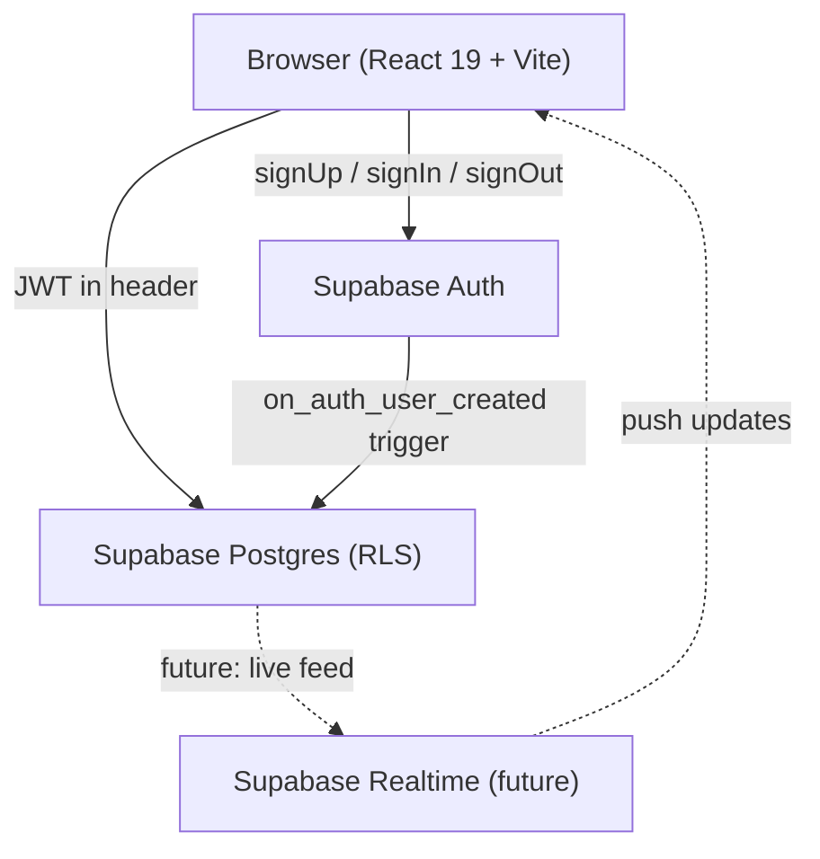
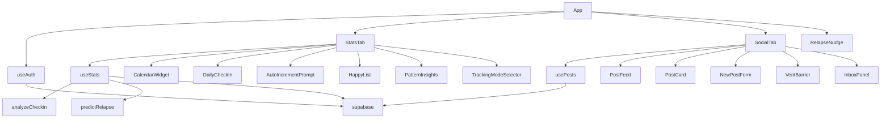
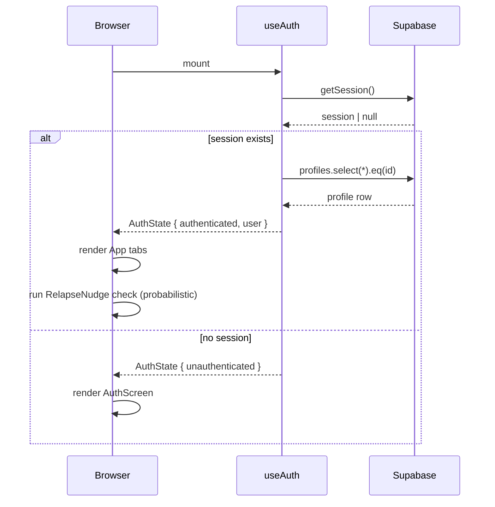
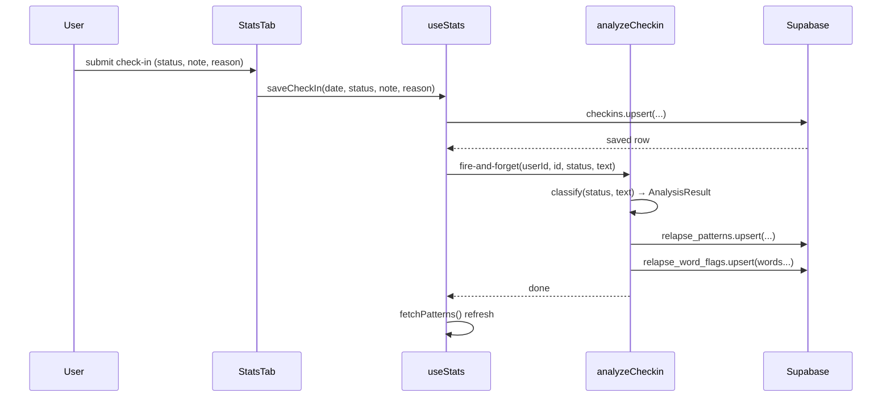
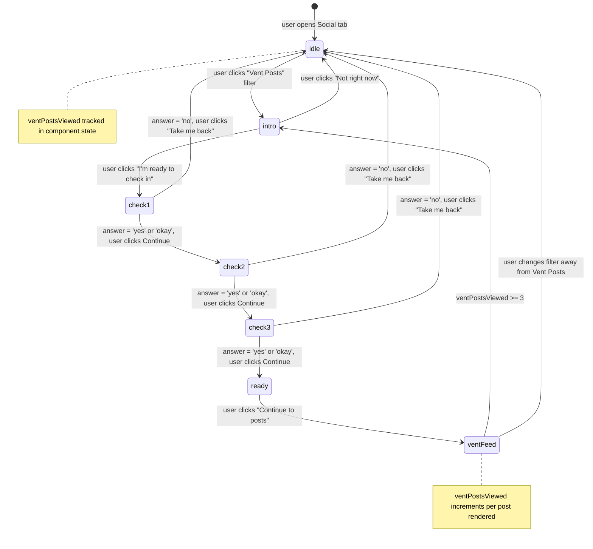

# Design Document: Recovery App

## Overview

The Recovery App is a compassionate, privacy-first addiction recovery companion built with React 19, TypeScript, Vite, and Supabase. It provides two core experiences: a **User Stats tab** for personal recovery tracking (calendar, check-ins, relapse prediction, and a "things that make me happy" list) and a **Social tab** for anonymous peer support (milestone posts, happy posts, and gated vent posts with a mental-health barrier). The app is designed to be non-judgmental, non-streak-focused, and subtly proactive about relapse prevention without being intrusive.

The prototype phase prioritises correctness of data models, algorithms, and component contracts over visual polish. All UI is plain HTML/CSS with no external component library. Sample data is seeded via Supabase SQL so every screen is populated on first load.

---

## Architecture

### System Components



### Frontend Module Map



### Data Flow: Page Load



### Data Flow: Check-in + Pattern Analysis



---

## Full Database Schema

### Updated Schema (extends existing)

```sql
-- ─── Profiles (extended) ─────────────────────────────────────────
CREATE TABLE profiles (
  id                  UUID REFERENCES auth.users ON DELETE CASCADE PRIMARY KEY,
  username            TEXT NOT NULL,
  tracking_mode       TEXT NOT NULL DEFAULT 'auto_increment'
                        CHECK (tracking_mode IN ('daily_checkin', 'auto_increment')),
  recovery_start_date DATE NOT NULL DEFAULT CURRENT_DATE,
  favorite_color      TEXT NOT NULL DEFAULT '#4f8a6e',  -- NEW: hex color for theme
  created_at          TIMESTAMPTZ NOT NULL DEFAULT NOW()
);

-- ─── Posts (unchanged) ───────────────────────────────────────────
CREATE TABLE posts (
  id             UUID PRIMARY KEY DEFAULT gen_random_uuid(),
  user_id        UUID,  -- nullable for seed data
  type           TEXT NOT NULL CHECK (type IN ('milestone', 'happy', 'vent')),
  content        TEXT NOT NULL,
  anonymous_name TEXT NOT NULL,
  created_at     TIMESTAMPTZ NOT NULL DEFAULT NOW()
);

-- ─── Replies (unchanged) ─────────────────────────────────────────
CREATE TABLE replies (
  id           UUID PRIMARY KEY DEFAULT gen_random_uuid(),
  post_id      UUID REFERENCES posts(id) ON DELETE CASCADE NOT NULL,
  sender_id    UUID REFERENCES profiles(id) ON DELETE CASCADE NOT NULL,
  recipient_id UUID REFERENCES profiles(id) ON DELETE CASCADE NOT NULL,
  content      TEXT NOT NULL,
  created_at   TIMESTAMPTZ NOT NULL DEFAULT NOW()
);

-- ─── Check-ins (extended) ────────────────────────────────────────
CREATE TABLE checkins (
  id             UUID PRIMARY KEY DEFAULT gen_random_uuid(),
  user_id        UUID REFERENCES profiles(id) ON DELETE CASCADE NOT NULL,
  date           DATE NOT NULL,
  status         TEXT NOT NULL CHECK (status IN ('clean', 'relapse')),
  note           TEXT,
  relapse_reason TEXT,
  ai_tags        TEXT[] DEFAULT '{}',   -- NEW: keyword tags from analyzeCheckin
  ai_processed   BOOLEAN DEFAULT FALSE, -- NEW: prevents re-analysis
  created_at     TIMESTAMPTZ NOT NULL DEFAULT NOW(),
  UNIQUE (user_id, date)
);

-- ─── Relapse Patterns (unchanged) ────────────────────────────────
CREATE TABLE relapse_patterns (
  id           UUID PRIMARY KEY DEFAULT gen_random_uuid(),
  user_id      UUID REFERENCES profiles(id) ON DELETE CASCADE NOT NULL,
  pattern_type TEXT NOT NULL,
  description  TEXT NOT NULL,
  frequency    INT NOT NULL DEFAULT 1,
  tags         TEXT[] DEFAULT '{}',
  last_seen    DATE,
  side         TEXT NOT NULL DEFAULT 'regression'
                 CHECK (side IN ('regression', 'protective')),
  created_at   TIMESTAMPTZ NOT NULL DEFAULT NOW()
);

-- ─── Happy Items (NEW) ───────────────────────────────────────────
CREATE TABLE happy_items (
  id           UUID PRIMARY KEY DEFAULT gen_random_uuid(),
  user_id      UUID REFERENCES profiles(id) ON DELETE CASCADE NOT NULL,
  title        TEXT NOT NULL,
  description  TEXT,
  energy_level INT NOT NULL DEFAULT 2 CHECK (energy_level BETWEEN 1 AND 5),
  prep_level   INT NOT NULL DEFAULT 1 CHECK (prep_level BETWEEN 1 AND 5),
  created_at   TIMESTAMPTZ NOT NULL DEFAULT NOW()
);

ALTER TABLE happy_items ENABLE ROW LEVEL SECURITY;
CREATE POLICY "Users manage their own happy items"
  ON happy_items FOR ALL USING (auth.uid() = user_id);

-- ─── Relapse Word Flags (NEW) ────────────────────────────────────
CREATE TABLE relapse_word_flags (
  id        UUID PRIMARY KEY DEFAULT gen_random_uuid(),
  user_id   UUID REFERENCES profiles(id) ON DELETE CASCADE NOT NULL,
  word      TEXT NOT NULL,
  frequency INT NOT NULL DEFAULT 1,
  last_seen DATE,
  UNIQUE (user_id, word)
);

ALTER TABLE relapse_word_flags ENABLE ROW LEVEL SECURITY;
CREATE POLICY "Users manage their own word flags"
  ON relapse_word_flags FOR ALL USING (auth.uid() = user_id);
```

### RLS Summary

| Table | Read | Write |
|---|---|---|
| profiles | own row only | own row only |
| posts | all authenticated | own rows only |
| replies | sender or recipient | sender only |
| checkins | own rows only | own rows only |
| relapse_patterns | own rows only | own rows only |
| happy_items | own rows only | own rows only |
| relapse_word_flags | own rows only | own rows only |

---

## Component Tree

```
App
├── AuthScreen                    (unauthenticated)
│   ├── SignInForm
│   └── SignUpForm
│       └── ColorPicker           (favorite_color selection)
│
├── AppHeader                     (authenticated)
│   └── ThemeProvider             (injects CSS vars from favorite_color)
│
├── TabNav                        (stats | social)
│
├── StatsTab                      (default tab)
│   ├── StatsNav                  (overview | calendar | happy | patterns | settings)
│   ├── OverviewPane
│   │   ├── StatCards             (total clean days, days since start)
│   │   ├── DailyCheckIn          (tracking_mode = daily_checkin)
│   │   └── AutoIncrementPrompt   (tracking_mode = auto_increment)
│   ├── CalendarPane
│   │   ├── CalendarWidget        (click-to-cycle, start-date guard)
│   │   └── DayDetailModal        (view/edit a specific day's check-in)
│   ├── HappyListPane
│   │   ├── HappyItemCard         (title, description, energy, prep badges)
│   │   └── AddHappyItemForm
│   ├── PatternInsights
│   └── SettingsPane
│       └── TrackingModeSelector
│
├── SocialTab
│   ├── PostFilterBar             (All | Milestones | Good Things | Vent Posts)
│   ├── PostFeed
│   │   └── PostCard[]
│   │       └── ReplyBox          (inline, private)
│   ├── NewPostForm
│   ├── VentBarrier               (state machine, shown before vent posts)
│   └── InboxPanel
│
└── RelapseNudge                  (probabilistic, non-obtrusive overlay/banner)
```

---

## TypeScript Interfaces

```typescript
// ─── Auth / Profile ───────────────────────────────────────────────────────────

export type TrackingMode = 'daily_checkin' | 'auto_increment'

export interface AppUser {
  id: string
  username: string
  trackingMode: TrackingMode
  recoveryStartDate: string   // YYYY-MM-DD
  favoriteColor: string       // hex e.g. '#4f8a6e'
}

// ─── Posts & Replies ──────────────────────────────────────────────────────────

export type PostType = 'milestone' | 'happy' | 'vent'

export interface Post {
  id: string
  userId: string | null       // null for seed posts
  type: PostType
  content: string
  anonymousName: string
  createdAt: string           // ISO timestamp
  replyCount?: number         // only visible to post owner
}

export interface Reply {
  id: string
  postId: string
  senderId: string
  recipientId: string
  content: string
  createdAt: string
  senderName: string          // anonymous name of sender
}

// ─── Check-ins ────────────────────────────────────────────────────────────────

export type DayStatus = 'clean' | 'relapse' | null

export interface CheckIn {
  id: string
  userId: string
  date: string                // YYYY-MM-DD
  status: 'clean' | 'relapse'
  note: string | null
  relapseReason: string | null
  aiTags?: string[]
  aiProcessed?: boolean
}

// ─── Relapse Patterns ─────────────────────────────────────────────────────────

export interface RelapsePattern {
  id: string
  patternType: string
  description: string
  frequency: number
  tags: string[]
  lastSeen: string | null
  side: 'regression' | 'protective'
}

// ─── Happy Items ──────────────────────────────────────────────────────────────

export interface HappyItem {
  id: string
  userId: string
  title: string
  description: string | null
  energyLevel: number         // 1–5
  prepLevel: number           // 1–5
  createdAt: string
}

// ─── Relapse Word Flags ───────────────────────────────────────────────────────

export interface RelapseWordFlag {
  id: string
  userId: string
  word: string
  frequency: number
  lastSeen: string | null     // YYYY-MM-DD
}

// ─── Relapse Prediction ───────────────────────────────────────────────────────

export type DistributionMode = 'unimodal' | 'bimodal'

export interface IntervalCluster {
  centroid: number        // mean interval in days for this cluster
  members: number[]       // intervals assigned to this cluster
  weight: number          // proportion of total intervals (0.0–1.0)
  predictedDate: string | null  // YYYY-MM-DD prediction from this cluster
  daysUntilPredicted: number | null
}

export interface NumericalPrediction {
  distributionMode: DistributionMode
  // Unimodal: single prediction
  predictedDate: string | null  // YYYY-MM-DD, null if insufficient data
  daysUntilPredicted: number | null
  averageInterval: number       // days (weighted mean across all intervals)
  intervalHistory: number[]     // days between each relapse
  confidence: 'low' | 'medium' | 'high'
  // Bimodal: two cluster predictions (populated when distributionMode = 'bimodal')
  clusters: IntervalCluster[]   // always length 2 when bimodal, empty when unimodal
  // The nearest upcoming predicted date across all active clusters
  nearestPredictedDate: string | null
  nearestDaysUntil: number | null
}

export interface WordRiskSignal {
  word: string
  riskScore: number             // 0.0–1.0
  recentOccurrences: number
  historicalFrequency: number
}

export interface RelapseRiskAssessment {
  overallRisk: 'none' | 'low' | 'medium' | 'high'
  numerical: NumericalPrediction
  wordSignals: WordRiskSignal[]
  triggeringWords: string[]     // words found in recent notes that match flags
  suggestedAction: NudgeAction | null
}

// ─── Nudge System ─────────────────────────────────────────────────────────────

export type NudgeType = 'milestone_prompt' | 'happy_item_suggestion' | 'none'

export interface NudgeAction {
  type: NudgeType
  message: string
  happyItem?: HappyItem         // present when type = 'happy_item_suggestion'
  askIfDoneRecently?: boolean   // true when energy_level >= 4
}

// ─── Vent Barrier ─────────────────────────────────────────────────────────────

export type BarrierStep = 'intro' | 'check1' | 'check2' | 'check3' | 'ready'
export type BarrierAnswer = 'yes' | 'okay' | 'no' | ''

export interface BarrierState {
  step: BarrierStep
  answers: {
    check1: BarrierAnswer   // emotional state
    check2: BarrierAnswer   // support availability
    check3: BarrierAnswer   // reading intention
  }
  ventPostsViewed: number   // resets to 0 after barrier; increments per vent post shown
  barrierPassed: boolean
}

// ─── Calendar ─────────────────────────────────────────────────────────────────

export interface CalendarDay {
  date: string              // YYYY-MM-DD
  status: DayStatus
  isToday: boolean
  isFuture: boolean
  isBeforeStartDate: boolean
}
```

---

## Key Algorithms

### 1. Numerical Relapse Prediction

Analyzes the sequence of days between relapses to predict when the next one might occur.

```typescript
/**
 * predictNumerical
 *
 * Preconditions:
 *   - checkIns is sorted ascending by date
 *   - checkIns contains at least 0 entries
 *
 * Postconditions:
 *   - Returns NumericalPrediction
 *   - If fewer than 2 relapses: confidence = 'low', predictedDate = null
 *   - If 2–4 relapses: confidence = 'medium'
 *   - If 5+ relapses: confidence = 'high'
 *   - predictedDate is always >= today
 *   - averageInterval is the mean of intervalHistory
 *
 * Loop invariant (interval accumulation):
 *   - At each iteration i, intervals[0..i-1] contains the correct day-gaps
 *     between consecutive relapse dates processed so far
 */
function predictNumerical(
  checkIns: CheckIn[],
  today: string
): NumericalPrediction {
  // 1. Extract relapse dates in ascending order
  const relapseDates = checkIns
    .filter(c => c.status === 'relapse')
    .map(c => c.date)
    .sort()

  if (relapseDates.length < 2) {
    return {
      predictedDate: null,
      confidence: 'low',
      averageInterval: 0,
      intervalHistory: [],
      daysUntilPredicted: null,
    }
  }

  // 2. Compute intervals between consecutive relapses
  const intervals: number[] = []
  for (let i = 1; i < relapseDates.length; i++) {
    const prev = new Date(relapseDates[i - 1])
    const curr = new Date(relapseDates[i])
    const days = Math.round((curr.getTime() - prev.getTime()) / 86_400_000)
    intervals.push(days)
  }

  // 3. Weighted average — recent intervals count more
  //    weight[i] = i + 1  (most recent = highest weight)
  let weightedSum = 0
  let totalWeight = 0
  intervals.forEach((interval, i) => {
    const weight = i + 1
    weightedSum += interval * weight
    totalWeight += weight
  })
  const avgInterval = Math.round(weightedSum / totalWeight)

  // 4. Predict from last relapse date
  const lastRelapse = new Date(relapseDates[relapseDates.length - 1])
  const predicted = new Date(lastRelapse)
  predicted.setDate(predicted.getDate() + avgInterval)

  // Clamp to today or future
  const todayDate = new Date(today)
  const finalPredicted = predicted < todayDate ? todayDate : predicted
  const predictedStr = finalPredicted.toISOString().split('T')[0]

  const daysUntil = Math.round(
    (finalPredicted.getTime() - todayDate.getTime()) / 86_400_000
  )

  const confidence =
    relapseDates.length >= 5 ? 'high' :
    relapseDates.length >= 2 ? 'medium' : 'low'

  return {
    predictedDate: predictedStr,
    confidence,
    averageInterval: avgInterval,
    intervalHistory: intervals,
    daysUntilPredicted: daysUntil,
  }
}
```

### 2. NLP Word-Flag Analysis

Identifies words that appear disproportionately in notes written in the days leading up to a relapse, compared to clean-day notes. These become "risk words" — if they appear in recent notes, a potential relapse is flagged.

```typescript
/**
 * buildWordFlags
 *
 * Preconditions:
 *   - checkIns sorted ascending by date
 *   - LOOKBACK_DAYS > 0
 *
 * Postconditions:
 *   - Returns map of word → { relapseFreq, cleanFreq, riskScore }
 *   - riskScore = relapseFreq / (relapseFreq + cleanFreq + 1)  [Laplace smoothed]
 *   - Only words with riskScore > RISK_THRESHOLD are returned
 *   - Stop words are excluded
 *
 * Loop invariant:
 *   - After processing check-in i, wordStats contains accurate counts
 *     for all check-ins 0..i
 */
const LOOKBACK_DAYS = 7       // days before a relapse to scan
const RISK_THRESHOLD = 0.6    // word must appear in relapse context 60%+ of the time
const MIN_WORD_LENGTH = 4
const STOP_WORDS = new Set([
  'that', 'this', 'with', 'have', 'from', 'they', 'will', 'been',
  'were', 'said', 'each', 'which', 'their', 'time', 'when', 'your',
  'just', 'know', 'into', 'than', 'then', 'some', 'could', 'about',
])

interface WordStats {
  relapseContextCount: number
  cleanContextCount: number
}

function buildWordFlags(checkIns: CheckIn[]): Map<string, WordStats> {
  const wordStats = new Map<string, WordStats>()

  // Build a date → status lookup for O(1) access
  const dateStatus = new Map<string, 'clean' | 'relapse'>()
  checkIns.forEach(c => dateStatus.set(c.date, c.status))

  checkIns.forEach(checkin => {
    const text = [checkin.note, checkin.relapseReason].filter(Boolean).join(' ')
    if (!text || text.trim().length < 5) return

    // Determine context: is there a relapse within LOOKBACK_DAYS after this note?
    const noteDate = new Date(checkin.date)
    let isPreRelapseContext = false
    for (let d = 1; d <= LOOKBACK_DAYS; d++) {
      const future = new Date(noteDate)
      future.setDate(future.getDate() + d)
      const futureStr = future.toISOString().split('T')[0]
      if (dateStatus.get(futureStr) === 'relapse') {
        isPreRelapseContext = true
        break
      }
    }

    // Tokenize and count
    const words = text
      .toLowerCase()
      .replace(/[^a-z\s]/g, '')
      .split(/\s+/)
      .filter(w => w.length >= MIN_WORD_LENGTH && !STOP_WORDS.has(w))

    const seen = new Set<string>()  // count each word once per check-in
    words.forEach(word => {
      if (seen.has(word)) return
      seen.add(word)

      const existing = wordStats.get(word) ?? { relapseContextCount: 0, cleanContextCount: 0 }
      if (isPreRelapseContext) {
        existing.relapseContextCount++
      } else {
        existing.cleanContextCount++
      }
      wordStats.set(word, existing)
    })
  })

  // Filter to only high-risk words
  const result = new Map<string, WordStats>()
  wordStats.forEach((stats, word) => {
    const total = stats.relapseContextCount + stats.cleanContextCount
    if (total < 2) return  // need at least 2 occurrences
    const riskScore = stats.relapseContextCount / (total + 1)
    if (riskScore >= RISK_THRESHOLD) {
      result.set(word, stats)
    }
  })

  return result
}

/**
 * detectWordRisk
 *
 * Scans recent check-in notes for words that match the user's word flags.
 *
 * Preconditions:
 *   - recentCheckIns are the last SCAN_DAYS days of check-ins
 *   - wordFlags is the output of buildWordFlags or loaded from relapse_word_flags table
 *
 * Postconditions:
 *   - Returns list of WordRiskSignal for each flagged word found
 *   - Empty list if no risk words detected
 */
const SCAN_DAYS = 3  // look at last 3 days of notes

function detectWordRisk(
  recentCheckIns: CheckIn[],
  wordFlags: RelapseWordFlag[]
): WordRiskSignal[] {
  const flagMap = new Map(wordFlags.map(f => [f.word, f]))
  const signals: WordRiskSignal[] = []

  const recentText = recentCheckIns
    .slice(-SCAN_DAYS)
    .flatMap(c => [c.note, c.relapseReason])
    .filter(Boolean)
    .join(' ')
    .toLowerCase()
    .replace(/[^a-z\s]/g, '')

  flagMap.forEach((flag, word) => {
    const regex = new RegExp(`\\b${word}\\b`, 'g')
    const matches = recentText.match(regex)
    if (matches && matches.length > 0) {
      signals.push({
        word,
        riskScore: Math.min(flag.frequency / 10, 1.0),
        recentOccurrences: matches.length,
        historicalFrequency: flag.frequency,
      })
    }
  })

  return signals.sort((a, b) => b.riskScore - a.riskScore)
}
```

### 3. Relapse Risk Assessment (Combined)

```typescript
/**
 * assessRelapseRisk
 *
 * Combines numerical prediction and word-flag detection into a single
 * risk assessment used by the nudge system.
 *
 * Preconditions:
 *   - checkIns sorted ascending
 *   - wordFlags loaded from DB
 *   - today is YYYY-MM-DD
 *
 * Postconditions:
 *   - overallRisk reflects the highest signal from either method
 *   - suggestedAction is null when overallRisk = 'none'
 *   - suggestedAction is non-null when overallRisk >= 'medium'
 */
function assessRelapseRisk(
  checkIns: CheckIn[],
  wordFlags: RelapseWordFlag[],
  happyItems: HappyItem[],
  today: string
): RelapseRiskAssessment {
  const numerical = predictNumerical(checkIns, today)
  const recentCheckIns = checkIns.filter(c => {
    const d = new Date(c.date)
    const t = new Date(today)
    return (t.getTime() - d.getTime()) / 86_400_000 <= SCAN_DAYS
  })
  const wordSignals = detectWordRisk(recentCheckIns, wordFlags)
  const triggeringWords = wordSignals.map(s => s.word)

  // Determine risk level
  let overallRisk: RelapseRiskAssessment['overallRisk'] = 'none'

  if (numerical.daysUntilPredicted !== null && numerical.daysUntilPredicted <= 3) {
    overallRisk = numerical.confidence === 'high' ? 'high' : 'medium'
  } else if (numerical.daysUntilPredicted !== null && numerical.daysUntilPredicted <= 7) {
    overallRisk = 'low'
  }

  if (wordSignals.length >= 3) overallRisk = 'high'
  else if (wordSignals.length >= 1 && overallRisk === 'none') overallRisk = 'low'
  else if (wordSignals.length >= 1) overallRisk = 'medium'

  const suggestedAction = overallRisk === 'none'
    ? null
    : buildNudgeAction(overallRisk, happyItems)

  return {
    overallRisk,
    numerical,
    wordSignals,
    triggeringWords,
    suggestedAction,
  }
}
```

### 4. Nudge Action Builder

```typescript
/**
 * buildNudgeAction
 *
 * Selects a non-obtrusive suggestion based on risk level and available happy items.
 * Randomly returns null ~40% of the time to avoid being annoying.
 *
 * Preconditions:
 *   - risk is 'low' | 'medium' | 'high'
 *   - happyItems may be empty
 *
 * Postconditions:
 *   - Returns null with probability 0.4 (random suppression)
 *   - For 'low': suggests a low-energy happy item (energyLevel <= 2)
 *   - For 'medium': suggests any happy item, milestone prompt, or nothing
 *   - For 'high': always returns a suggestion
 *   - askIfDoneRecently = true when suggested item has energyLevel >= 4
 */
function buildNudgeAction(
  risk: 'low' | 'medium' | 'high',
  happyItems: HappyItem[]
): NudgeAction | null {
  // Random suppression — must not be obtrusive
  if (risk !== 'high' && Math.random() < 0.4) return null

  const lowEnergyItems = happyItems.filter(i => i.energyLevel <= 2)
  const anyItems = happyItems

  if (risk === 'low') {
    if (lowEnergyItems.length === 0) return null
    const item = lowEnergyItems[Math.floor(Math.random() * lowEnergyItems.length)]
    return {
      type: 'happy_item_suggestion',
      message: `Something small that might help: ${item.title}`,
      happyItem: item,
      askIfDoneRecently: item.energyLevel >= 4,
    }
  }

  if (risk === 'medium') {
    const roll = Math.random()
    if (roll < 0.5 && anyItems.length > 0) {
      const item = anyItems[Math.floor(Math.random() * anyItems.length)]
      return {
        type: 'happy_item_suggestion',
        message: `You've got this. Maybe try: ${item.title}`,
        happyItem: item,
        askIfDoneRecently: item.energyLevel >= 4,
      }
    }
    return {
      type: 'milestone_prompt',
      message: 'You\'ve come a long way. Feel like logging a milestone?',
    }
  }

  // high risk — always suggest
  if (anyItems.length > 0) {
    const item = anyItems[Math.floor(Math.random() * anyItems.length)]
    return {
      type: 'happy_item_suggestion',
      message: `Hey — ${item.title} is on your list. Have you been able to do that recently?`,
      happyItem: item,
      askIfDoneRecently: true,
    }
  }
  return {
    type: 'milestone_prompt',
    message: 'You\'ve come a long way. Feel like logging a milestone?',
  }
}
```

---

## Vent Barrier State Machine

The vent barrier is a finite state machine that gates access to vent posts. It must be completed before any vent posts are shown, and resets after the user views 3 vent posts.



### Barrier State Interface

```typescript
// Transition function — pure, no side effects
function transitionBarrier(
  state: BarrierState,
  action:
    | { type: 'START' }
    | { type: 'ANSWER'; step: 'check1' | 'check2' | 'check3'; value: BarrierAnswer }
    | { type: 'NEXT' }
    | { type: 'PASS' }
    | { type: 'DECLINE' }
    | { type: 'POST_VIEWED' }
    | { type: 'RESET' }
): BarrierState {
  switch (action.type) {
    case 'START':
      return { ...state, step: 'intro' }

    case 'ANSWER':
      return {
        ...state,
        answers: { ...state.answers, [action.step]: action.value },
      }

    case 'NEXT': {
      const order: BarrierStep[] = ['intro', 'check1', 'check2', 'check3', 'ready']
      const idx = order.indexOf(state.step)
      return { ...state, step: order[Math.min(idx + 1, order.length - 1)] }
    }

    case 'PASS':
      return { ...state, step: 'ready', barrierPassed: true }

    case 'DECLINE':
      return {
        step: 'intro',
        answers: { check1: '', check2: '', check3: '' },
        ventPostsViewed: 0,
        barrierPassed: false,
      }

    case 'POST_VIEWED': {
      const viewed = state.ventPostsViewed + 1
      if (viewed >= 3) {
        // Reset barrier — user must go through it again
        return {
          step: 'intro',
          answers: { check1: '', check2: '', check3: '' },
          ventPostsViewed: 0,
          barrierPassed: false,
        }
      }
      return { ...state, ventPostsViewed: viewed }
    }

    case 'RESET':
      return {
        step: 'intro',
        answers: { check1: '', check2: '', check3: '' },
        ventPostsViewed: 0,
        barrierPassed: false,
      }

    default:
      return state
  }
}
```

---

## Component Signatures

### Authentication

```typescript
// AuthScreen.tsx
interface AuthScreenProps {
  onSignIn: (email: string, password: string) => Promise<void>
  onSignUp: (
    email: string,
    password: string,
    username: string,
    recoveryStartDate: string,
    favoriteColor: string
  ) => Promise<void>
}

// ColorPicker.tsx — used inside SignUpForm
interface ColorPickerProps {
  value: string           // hex color
  onChange: (hex: string) => void
  presets: string[]       // suggested palette
}
```

### Stats Tab

```typescript
// StatsTab.tsx
interface StatsTabProps {
  userId: string
  username: string
  trackingMode: TrackingMode
  recoveryStartDate: string
  favoriteColor: string
  onTrackingModeChange: (mode: TrackingMode) => void
}

// CalendarWidget.tsx
interface CalendarWidgetProps {
  checkIns: CheckIn[]
  recoveryStartDate: string   // guard: prompt to change start date if clicking before this
  onDayUpdate: (date: string, status: DayStatus) => void
  onDaySelect: (date: string) => void   // opens DayDetailModal
}

// DayDetailModal.tsx
interface DayDetailModalProps {
  date: string
  checkIn: CheckIn | null
  onSave: (status: 'clean' | 'relapse', note: string, relapseReason: string) => void
  onClose: () => void
}

// HappyList.tsx
interface HappyListProps {
  items: HappyItem[]
  onAdd: (item: Omit<HappyItem, 'id' | 'userId' | 'createdAt'>) => Promise<void>
  onRemove: (id: string) => Promise<void>
}

// HappyItemCard.tsx
interface HappyItemCardProps {
  item: HappyItem
  onRemove: (id: string) => void
}

// AddHappyItemForm.tsx
interface AddHappyItemFormProps {
  onSubmit: (item: Omit<HappyItem, 'id' | 'userId' | 'createdAt'>) => Promise<void>
  onCancel: () => void
}

// PatternInsights.tsx
interface PatternInsightsProps {
  patterns: RelapsePattern[]
  totalCleanDays: number
  totalDays: number
  relapseCount: number
  riskAssessment?: RelapseRiskAssessment   // optional, shown only when risk >= medium
}

// DailyCheckIn.tsx
interface DailyCheckInProps {
  todayCheckIn: CheckIn | null
  onSubmit: (status: 'clean' | 'relapse', note: string, relapseReason: string) => Promise<void>
}

// AutoIncrementPrompt.tsx
interface AutoIncrementPromptProps {
  lastPromptDate: string | null
  onConfirm: (note: string) => Promise<void>
  onRelapse: (reason: string) => Promise<void>
}
```

### Social Tab

```typescript
// SocialTab.tsx
interface SocialTabProps {
  currentUserId: string
}

// PostFeed.tsx
interface PostFeedProps {
  posts: Post[]
  currentUserId: string
  filter: PostFilter
  onReply: (postId: string, recipientId: string, content: string) => Promise<boolean>
}

// PostCard.tsx
interface PostCardProps {
  post: Post
  currentUserId: string
  isOwn: boolean
  onReply: (postId: string, recipientId: string, content: string) => Promise<boolean>
  onVentPostViewed?: () => void   // called when a vent post is rendered (for barrier counter)
}

// NewPostForm.tsx
interface NewPostFormProps {
  onSubmit: (type: PostType, content: string) => Promise<Post | null>
}

// VentBarrier.tsx
interface VentBarrierProps {
  state: BarrierState
  dispatch: React.Dispatch<BarrierAction>
}

// InboxPanel.tsx
interface InboxPanelProps {
  replies: Reply[]
  onClose: () => void
}

// RelapseNudge.tsx — rendered at App level, non-obtrusive
interface RelapseNudgeProps {
  assessment: RelapseRiskAssessment | null
  onDismiss: () => void
  onLogMilestone: () => void
}
```

---

## Supabase Query Patterns

### Auth: Sign Up with Profile

```typescript
// 1. Create auth user
const { data, error } = await supabase.auth.signUp({ email, password })

// 2. Insert profile (trigger also fires, but we insert explicitly for reliability)
await supabase.from('profiles').insert({
  id: data.user.id,
  username,
  tracking_mode: 'auto_increment',
  recovery_start_date: recoveryStartDate,
  favorite_color: favoriteColor,
})
```

### Fetch Posts with Reply Counts (owner-aware)

```typescript
// Fetch all posts
const { data: posts } = await supabase
  .from('posts')
  .select('*')
  .order('created_at', { ascending: false })
  .limit(50)

// Fetch reply counts — only for posts owned by current user
// (RLS ensures sender/recipient only; we count by post_id for owned posts)
const { data: ownedReplyCounts } = await supabase
  .from('replies')
  .select('post_id')
  .eq('recipient_id', currentUserId)

// Build count map — only expose counts to post owner in UI layer
const countMap = new Map<string, number>()
ownedReplyCounts?.forEach(r => {
  countMap.set(r.post_id, (countMap.get(r.post_id) ?? 0) + 1)
})

// In PostCard: only show replyCount if post.userId === currentUserId
```

### Upsert Check-in

```typescript
const { data } = await supabase
  .from('checkins')
  .upsert(
    { user_id: userId, date, status, note, relapse_reason: relapseReason },
    { onConflict: 'user_id,date' }
  )
  .select()
  .single()
```

### Upsert Relapse Word Flags

```typescript
// Called from analyzeCheckin after extracting risk words
async function upsertWordFlags(userId: string, words: string[]): Promise<void> {
  const today = new Date().toISOString().split('T')[0]
  for (const word of words) {
    const { data: existing } = await supabase
      .from('relapse_word_flags')
      .select('id, frequency')
      .eq('user_id', userId)
      .eq('word', word)
      .maybeSingle()

    if (existing) {
      await supabase
        .from('relapse_word_flags')
        .update({ frequency: existing.frequency + 1, last_seen: today })
        .eq('id', existing.id)
    } else {
      await supabase
        .from('relapse_word_flags')
        .insert({ user_id: userId, word, frequency: 1, last_seen: today })
    }
  }
}
```

### Happy Items CRUD

```typescript
// Fetch
const { data } = await supabase
  .from('happy_items')
  .select('*')
  .eq('user_id', userId)
  .order('created_at', { ascending: false })

// Insert
await supabase.from('happy_items').insert({
  user_id: userId, title, description, energy_level: energyLevel, prep_level: prepLevel,
})

// Delete
await supabase.from('happy_items').delete().eq('id', itemId).eq('user_id', userId)
```

### Calendar: Start Date Guard

```typescript
// In CalendarWidget — before calling onDayUpdate
function handleDayClick(dateStr: string, recoveryStartDate: string): void {
  const clicked = new Date(dateStr)
  const startDate = new Date(recoveryStartDate)

  if (clicked < startDate) {
    // Prompt user to change their start date first
    setStartDatePromptVisible(true)
    setPendingDate(dateStr)
    return
  }

  // Normal click-to-cycle logic
  const current = checkInMap.get(dateStr) ?? null
  const next: DayStatus =
    current === null ? 'clean' :
    current === 'clean' ? 'relapse' : null
  onDayUpdate(dateStr, next)
}
```

---

## Color Theming

The user's `favorite_color` is used to generate a CSS custom property theme injected at the root level. The theme derives accessible variants from the base color.

```typescript
// ThemeProvider.tsx
interface ThemeProviderProps {
  favoriteColor: string   // hex e.g. '#4f8a6e'
  children: React.ReactNode
}

// Injects into document.documentElement:
// --color-primary: #4f8a6e
// --color-primary-light: (lightened 20%)
// --color-primary-dark: (darkened 15%)
// --color-primary-contrast: #ffffff or #000000 (WCAG AA contrast)

function hexToHsl(hex: string): [number, number, number] { /* ... */ }
function hslToHex(h: number, s: number, l: number): string { /* ... */ }

function deriveTheme(hex: string): Record<string, string> {
  const [h, s, l] = hexToHsl(hex)
  return {
    '--color-primary': hex,
    '--color-primary-light': hslToHex(h, s, Math.min(l + 20, 95)),
    '--color-primary-dark': hslToHex(h, s, Math.max(l - 15, 10)),
    '--color-primary-contrast': l > 50 ? '#000000' : '#ffffff',
  }
}
```

---

## Error Handling

### Auth Errors

| Scenario | Response |
|---|---|
| Invalid credentials | Show "Invalid email or password" inline |
| Email already in use | Show "An account with this email already exists" |
| Weak password | Show "Password must be at least 6 characters" |
| Network error | Show "Connection error — please try again" |

### Check-in Errors

| Scenario | Response |
|---|---|
| Upsert fails | Show inline error, preserve form state |
| Pattern analysis fails | Silent — fire-and-forget, never blocks UI |
| Word flag upsert fails | Silent — non-critical |

### Social Errors

| Scenario | Response |
|---|---|
| Post fetch fails | Show "Couldn't load posts" with retry button |
| Post creation fails | Show inline error, preserve draft |
| Reply send fails | Show "Couldn't send reply — try again" |

### Calendar Errors

| Scenario | Response |
|---|---|
| Day update fails | Revert optimistic update, show toast |
| Click before start date | Show modal: "This date is before your recovery start date. Would you like to update your start date?" |

---

## Testing Strategy

### Unit Testing (Vitest + Testing Library)

Key units to test:

- `predictNumerical`: given known relapse date arrays, assert correct interval calculation, weighted average, and confidence levels
- `buildWordFlags`: given check-ins with known notes and relapse patterns, assert correct risk word identification
- `detectWordRisk`: given recent notes and word flags, assert correct signal detection
- `assessRelapseRisk`: integration of numerical + word signals, assert correct overall risk level
- `transitionBarrier`: all state transitions, including the 3-post reset
- `buildNudgeAction`: given risk levels and happy items, assert correct action types
- `CalendarWidget`: click-to-cycle behavior, start-date guard prompt
- `VentBarrier`: step progression, decline paths, SAMHSA number display

### Property-Based Testing (fast-check)

**Property test library**: fast-check

Key properties:

1. `predictNumerical` — for any sorted list of relapse dates with ≥2 entries, `predictedDate` is always ≥ today
2. `buildWordFlags` — for any check-in list, no stop word appears in the output map
3. `transitionBarrier` — for any sequence of valid actions, `ventPostsViewed` never exceeds 3 before resetting
4. `buildNudgeAction` — for any `happyItems` list, `askIfDoneRecently` is always `true` when `energyLevel >= 4`
5. `assessRelapseRisk` — `overallRisk = 'none'` implies `suggestedAction = null`

### Integration Testing

- Full sign-up → profile creation → color theme applied
- Check-in submission → pattern analysis → word flags upserted
- Vent barrier completion → 3 posts viewed → barrier resets
- Calendar click before start date → prompt shown → no update made

---

## Performance Considerations

- Pattern analysis (`analyzeCheckin`) is fire-and-forget — never blocks the UI
- Word flag upserts are batched per check-in, not per word (single async call chain)
- Post feed is limited to 50 posts; pagination can be added later
- Reply counts are fetched in a single query and mapped client-side
- `predictNumerical` and `buildWordFlags` run client-side on the user's check-in array (typically < 1000 entries) — O(n) complexity, negligible
- `RelapseNudge` runs once per page navigation, not on every render

---

## Security Considerations

- All tables have Row Level Security enabled — users can only access their own data
- `favorite_color` is stored as a hex string; CSS injection is prevented by validating the format (`/^#[0-9a-fA-F]{6}$/`) before applying to DOM
- Reply counts are only exposed to the post owner in the UI layer (not enforced at DB level for seed data compatibility, but enforced in component logic)
- Vent post content is readable by all authenticated users (by design — community support), but the barrier is a UX gate, not a security gate
- Auth tokens are managed entirely by Supabase JS client — never stored manually
- `relapse_reason` and `note` fields are private to the user via RLS

---

## Dependencies

| Package | Version | Purpose |
|---|---|---|
| react | ^19.2.5 | UI framework |
| react-dom | ^19.2.5 | DOM rendering |
| @supabase/supabase-js | ^2.49.4 | Auth + database client |
| vite | ^8.0.10 | Build tool + dev server |
| typescript | ~6.0.2 | Type safety |
| vitest | ^3.2.4 | Test runner |
| @testing-library/react | ^16.3.0 | Component testing |
| @testing-library/user-event | ^14.5.2 | User interaction simulation |
| @testing-library/jest-dom | ^6.6.3 | DOM matchers |
| fast-check | (to be added) | Property-based testing |

No UI component library is used in the prototype phase. All styling is plain CSS with CSS custom properties for theming.

---

## Sample Data Strategy

All sample data is seeded via `supabase/seed.sql`. The seed creates:

- 3 fake user profiles with different tracking modes and favorite colors
- 10 posts (mix of milestone, happy, vent types) with anonymous names
- 30 check-ins per user spanning 60 days (mix of clean and relapse)
- 5 relapse patterns per user (mix of regression and protective)
- 3 happy items per user with varying energy/prep levels
- Relapse word flags derived from the seeded check-in notes

This ensures every screen has meaningful content on first load without requiring real user activity.

---

## Correctness Properties

*A property is a characteristic or behavior that should hold true across all valid executions of a system — essentially, a formal statement about what the system should do. Properties serve as the bridge between human-readable specifications and machine-verifiable correctness guarantees.*

### Property 1: Sign-up profile completeness

*For any* valid sign-up input (email, password, username, recovery_start_date, favorite_color), the resulting profile row SHALL contain all five fields with the exact values provided.

**Validates: Requirements 1.1**

---

### Property 2: Favorite color format validation

*For any* string that does not match `^#[0-9a-fA-F]{6}$`, the Auth_System SHALL reject it as a `favorite_color` value and not create a profile.

**Validates: Requirements 1.4**

---

### Property 3: Theme derivation completeness

*For any* valid hex color string, `deriveTheme` SHALL return an object containing all four keys: `--color-primary`, `--color-primary-light`, `--color-primary-dark`, and `--color-primary-contrast`, with values that are valid CSS color strings.

**Validates: Requirements 2.1, 2.2, 2.3**

---

### Property 4: Theme contrast correctness

*For any* valid hex color with HSL lightness > 50%, `--color-primary-contrast` SHALL be `#000000`; for lightness ≤ 50%, it SHALL be `#ffffff`.

**Validates: Requirements 2.2**

---

### Property 5: Check-in upsert idempotence

*For any* user ID and date, submitting multiple check-ins for the same date SHALL result in exactly one row in the `checkins` table, containing the values from the most recent submission.

**Validates: Requirements 4.1, 4.4**

---

### Property 6: Calendar click-to-cycle state machine

*For any* calendar day on or after `recovery_start_date` that is not a future date, clicking the day SHALL advance its status through the cycle `null → 'clean' → 'relapse' → null` in order, with no skipped or repeated states.

**Validates: Requirements 6.1**

---

### Property 7: Calendar future-date immutability

*For any* future date, clicking the CalendarWidget SHALL leave the day's status unchanged.

**Validates: Requirements 6.3**

---

### Property 8: Happy item energy/prep range enforcement

*For any* happy item submission where `energyLevel` or `prepLevel` is outside the integer range [1, 5], THE HappyList SHALL reject the submission and the item SHALL NOT appear in the database.

**Validates: Requirements 7.3**

---

### Property 9: Happy item round-trip persistence

*For any* valid happy item (title non-empty, energyLevel and prepLevel in [1, 5]), adding it to the HappyList and then fetching the user's items SHALL return a list that contains an item with the same title, energyLevel, and prepLevel.

**Validates: Requirements 7.2**

---

### Property 10: Word flags exclude stop words

*For any* check-in list, no word in the StopWords set SHALL appear as a key in the output of `buildWordFlags`.

**Validates: Requirements 8.2**

---

### Property 11: Word flags minimum evidence and risk threshold

*For any* word in the output of `buildWordFlags`, its total occurrence count SHALL be at least 2 AND its Laplace-smoothed risk score (`relapseContextCount / (relapseContextCount + cleanContextCount + 1)`) SHALL be ≥ 0.6.

**Validates: Requirements 8.4, 8.5**

---

### Property 12: Predicted date is never in the past

*For any* sorted check-in array with 2 or more relapse entries and any value of `today`, the `predictedDate` returned by `predictNumerical` SHALL be greater than or equal to `today`.

**Validates: Requirements 9.5**

---

### Property 13: Confidence level matches relapse count

*For any* sorted check-in array, the `confidence` returned by `predictNumerical` SHALL be `'low'` when fewer than 2 relapses exist, `'medium'` when 2–4 relapses exist, and `'high'` when 5 or more relapses exist.

**Validates: Requirements 9.1, 9.2, 9.3**

---

### Property 14: Weighted average interval correctness

*For any* interval list of length n, the `averageInterval` returned by `predictNumerical` SHALL equal `round(Σ(interval[i] × (i+1)) / Σ(i+1))` for i in [0, n-1].

**Validates: Requirements 9.4**

---

### Property 15: No risk implies no action

*For any* check-in array, word flags, and happy items where `assessRelapseRisk` returns `overallRisk = 'none'`, the `suggestedAction` field SHALL be `null`.

**Validates: Requirements 10.6**

---

### Property 16: High word-signal count forces high risk

*For any* inputs to `assessRelapseRisk` where `wordSignals.length >= 3`, the `overallRisk` SHALL be `'high'` regardless of the numerical prediction.

**Validates: Requirements 10.4**

---

### Property 17: High risk always produces a nudge action

*For any* happy items list (including empty), `buildNudgeAction` with `risk = 'high'` SHALL return a non-null `NudgeAction`.

**Validates: Requirements 11.1**

---

### Property 18: askIfDoneRecently set for high-energy items

*For any* `NudgeAction` of type `'happy_item_suggestion'` where the referenced `HappyItem` has `energyLevel >= 4`, the `askIfDoneRecently` field SHALL be `true`.

**Validates: Requirements 11.5**

---

### Property 19: Vent barrier ventPostsViewed never exceeds 3 before reset

*For any* sequence of valid `transitionBarrier` actions, `ventPostsViewed` SHALL never be greater than 2 in the returned state (it resets to 0 when it would reach 3).

**Validates: Requirements 12.7**

---

### Property 20: Vent barrier 'no' answer always returns to idle

*For any* barrier state at step `check1`, `check2`, or `check3`, dispatching `DECLINE` SHALL return a state with `step = 'intro'`, `barrierPassed = false`, and `ventPostsViewed = 0`.

**Validates: Requirements 12.3**

---

### Property 21: Post filter correctness

*For any* post type filter selection (other than "All") and any post list, all posts returned by the filtered feed SHALL have a `type` field equal to the selected filter value.

**Validates: Requirements 13.3**

---

### Property 22: Reply required fields completeness

*For any* reply persisted to the `replies` table, the row SHALL contain non-null values for `sender_id`, `recipient_id`, `post_id`, and `content`.

**Validates: Requirements 14.1**
